# Curative pharmacy

(Curative Pharmacy) is an application that helps the user to find medicines easily and allows the user to add an image of the prescription. The system analyzes the image and shows the result to save time for the user. It also allows the user to view the latest news and the latest research related to public health.

## Clean Architecture

## UI Layer: MVVM

## Data Layer: Repository

Below you can find the docs for each technology that is used in this app:

## Firebase Products:

- [Firebase Auth][12]
- [Firebase Crashlytics][14]

## Android Architecture Components:

- [LiveData][4]
- [MutableState][17]
- [ViewModel][5]

## Dependency Injection:

- [Hilt for Android][6]

## Asynchronous Programming:

- [Kotlin Coroutines][7]
- [Asynchronous Flow][8]

## Other Android Components:

- [Jetpack Compose][9]

## Http Request:

- [OkHttp][18]
- [Retrofit][19]

[1]: https://kotlinlang.org/
[2]: https://firebase.google.com/docs/firestore
[3]: https://developer.android.com/topic/libraries/architecture
[4]: https://developer.android.com/topic/libraries/architecture/livedata
[6]: https://developer.android.com/training/dependency-injection/hilt-android
[7]: https://kotlinlang.org/docs/coroutines-overview.html
[8]: https://kotlinlang.org/docs/flow.html
[9]: https://developer.android.com/jetpack/compose
[10]: https://medium.com/firebase-tips-tricks/how-to-make-a-clean-architecture-android-app-using-mvvm-firestore-and-jetpack-compose-abdb5e02a2d8
[11]: https://firebase.google.com/docs/android/setup
[12]: https://firebase.google.com/docs/auth
[13]: https://firebase.google.com/docs/storage
[14]: https://firebase.google.com/docs/crashlytics
[15]: https://firebase.google.com/docs/perf-mon
[16]: https://firebase.google.com/docs/analytics
[17]: https://developer.android.com/reference/kotlin/androidx/compose/runtime/MutableState
[18]: https://square.github.io/okhttp/
[19]: https://square.github.io/retrofit/

# Screensout

### Signin
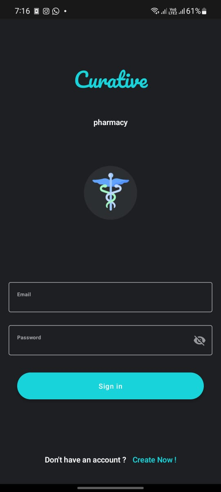

### SignUp
| light mode   | dark mode |
| ------------- | ------------- |
|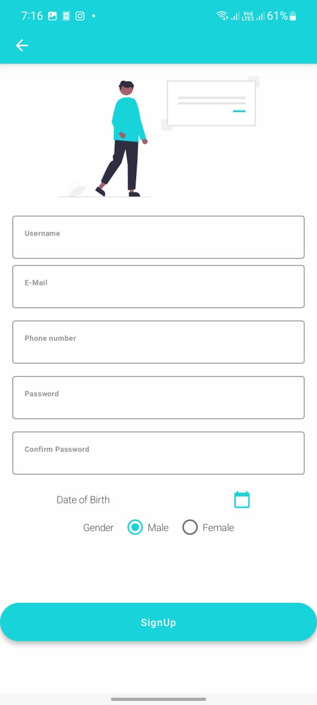 | 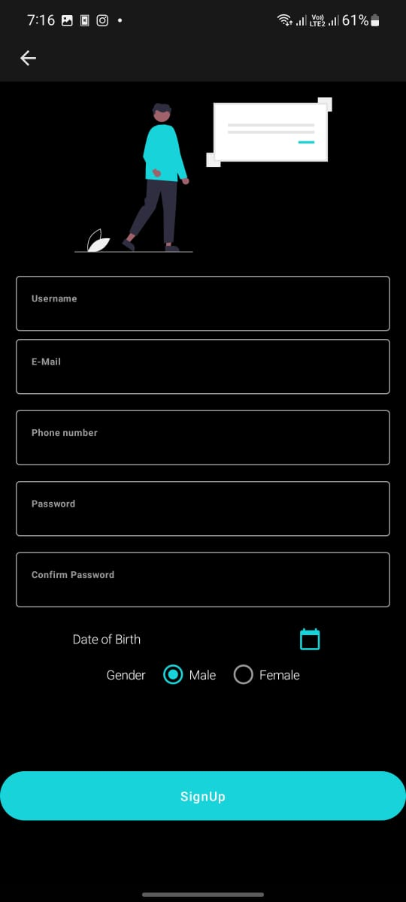  |

### OTP

### products
| light mode   | dark mode |
| ------------- | ------------- |
|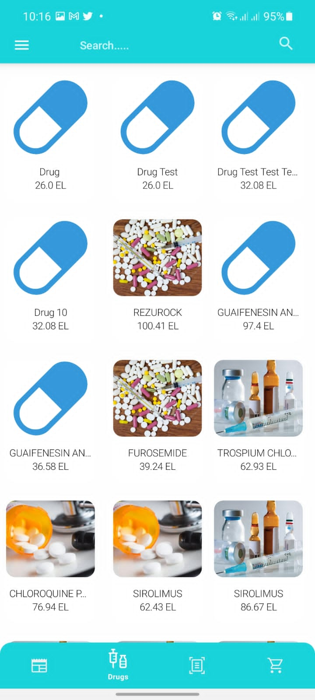 | 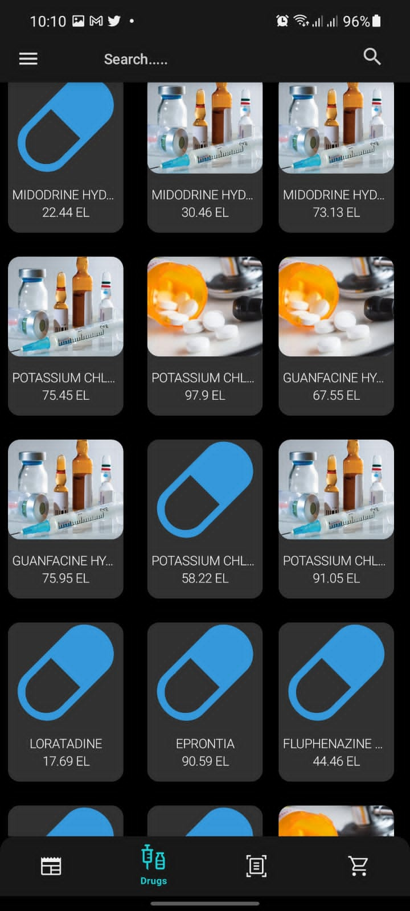  |

### product details
| light mode   | dark mode |
| ------------- | ------------- |
|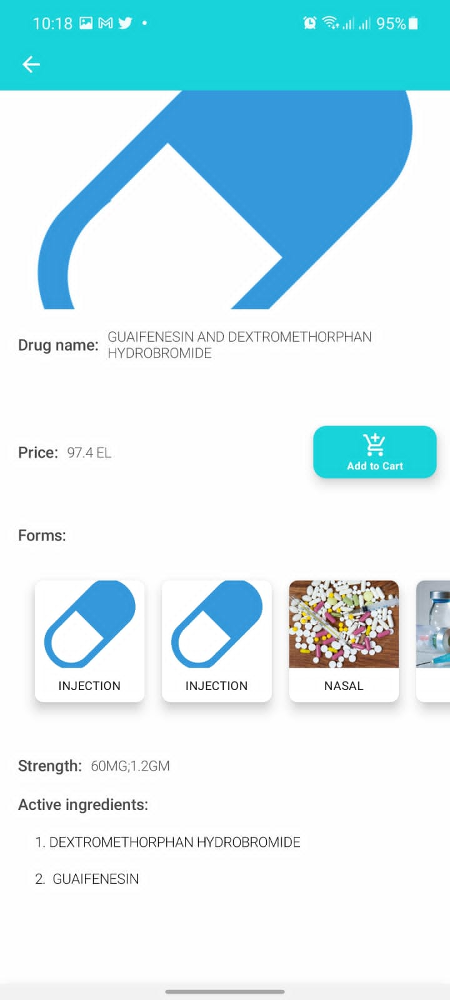 | 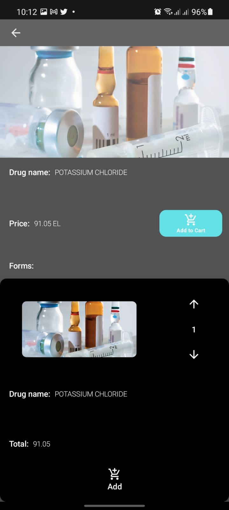  |

### OCR
| light mode   | dark mode |
| ------------- | ------------- |
|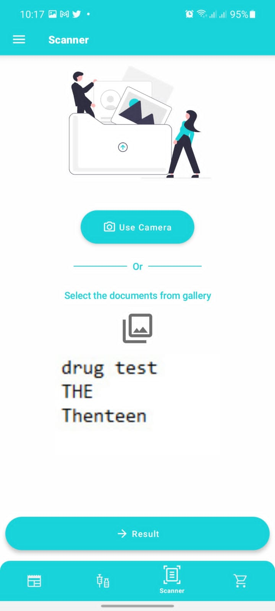 | 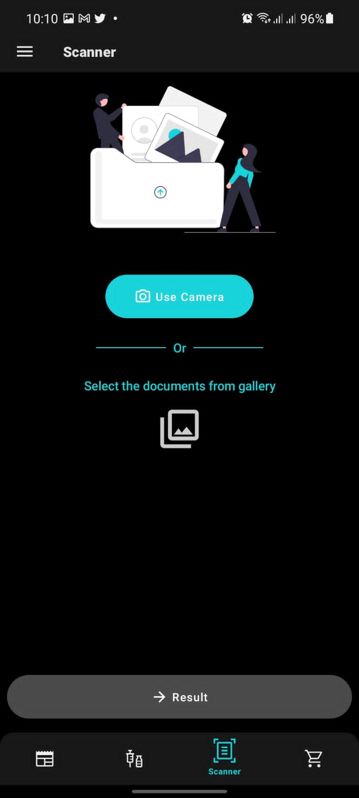  |

### OCR Result
| light mode   | dark mode |
| ------------- | ------------- |
| | 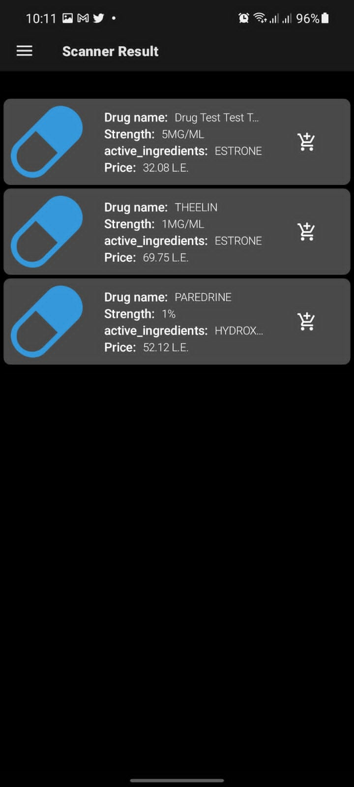  |

| light mode   | dark mode |
| ------------- | ------------- |
|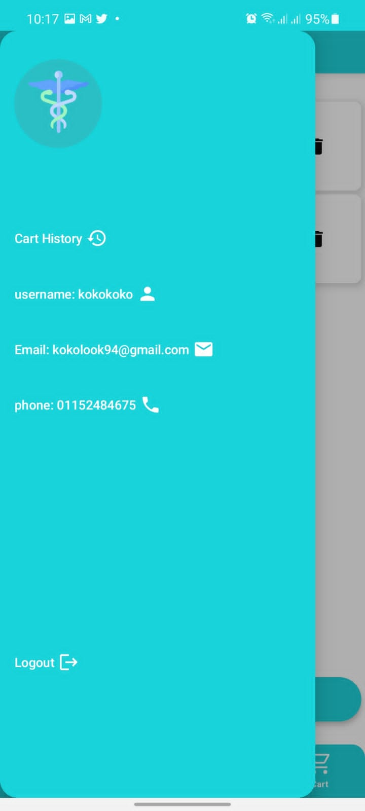 | 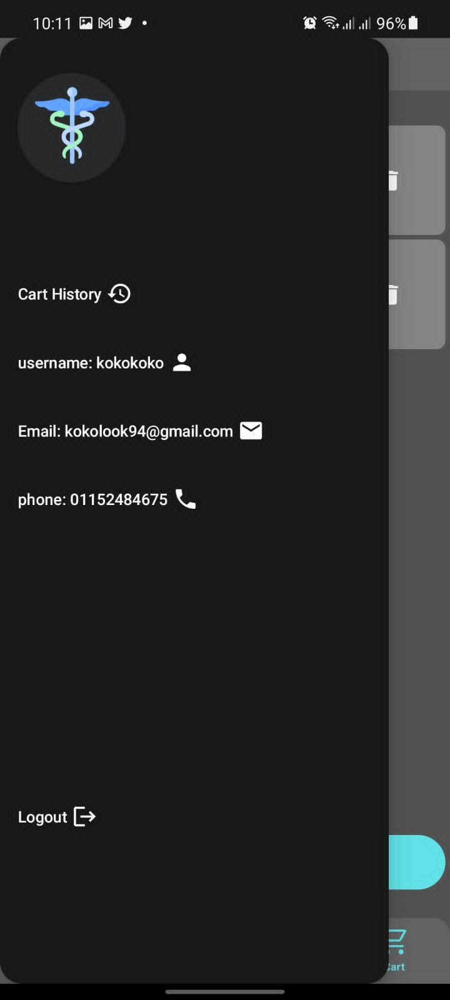  |

### Cart
| light mode   | dark mode |
| ------------- | ------------- |
|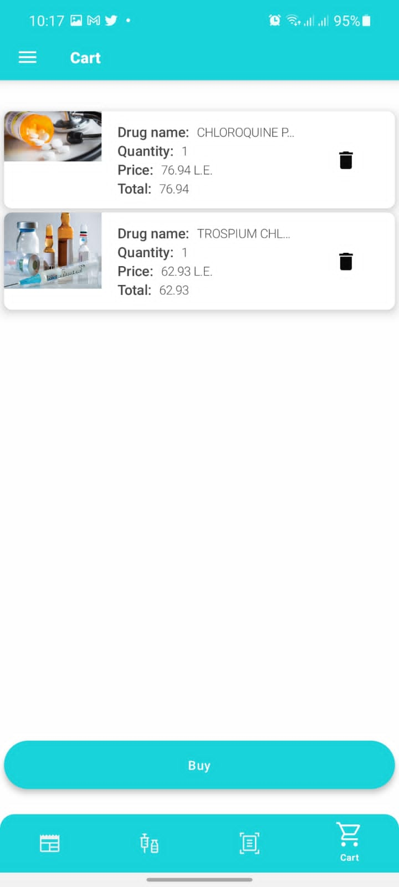 | 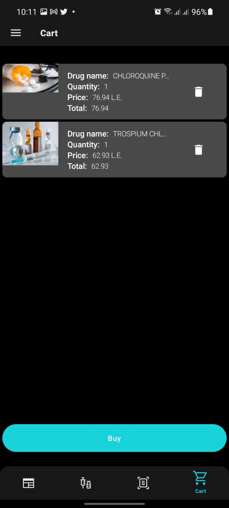  |

### History
| light mode   | dark mode |
| ------------- | ------------- |
|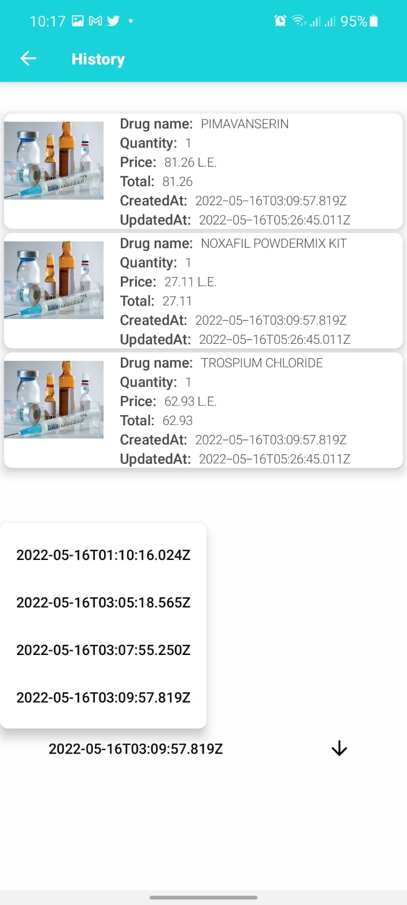 | 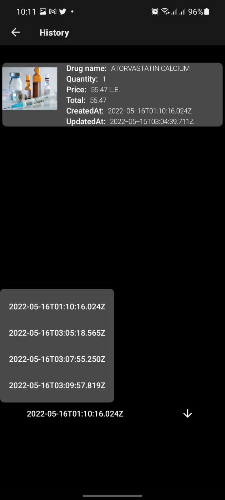  |

### Search
| light mode   | dark mode |
| ------------- | ------------- |
|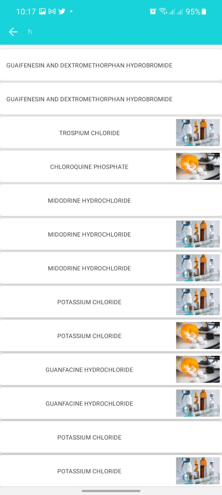 | 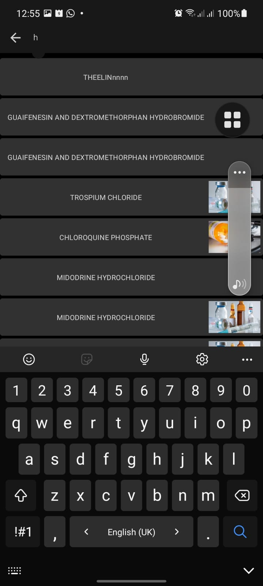  |

